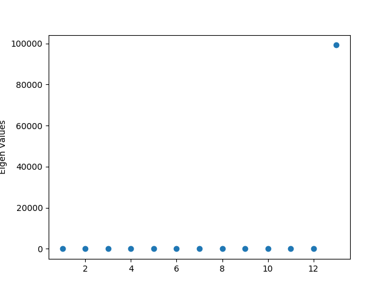
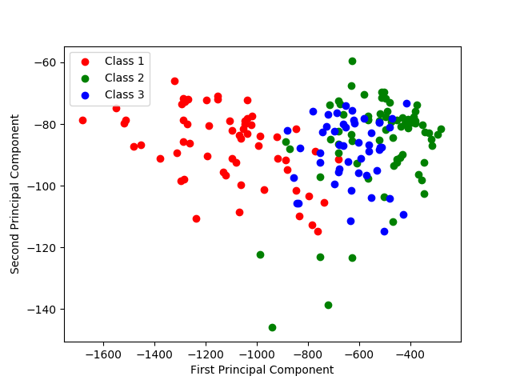

# Principal Component Analysis of Wine Data Set
## Representation and Similarity Measures 

### Dataset: `Wine Data` (178 data, 13 attributes divided into 3 categories)

### Eigen Values
The Eigen Values of the covariance matrix of data is :

We can see that the first eigen vector contributes to 99 percent of the data. So, if we take the first eigen vector to represent the data we will be able to preserve 99 percent of the data.

### Projection on two eigen vectors
 
 When the wine data is projected on the first two eigen vectors, the observation is that the three classes are separable by a line perpendicular to the first eigen vector with some outliers.

